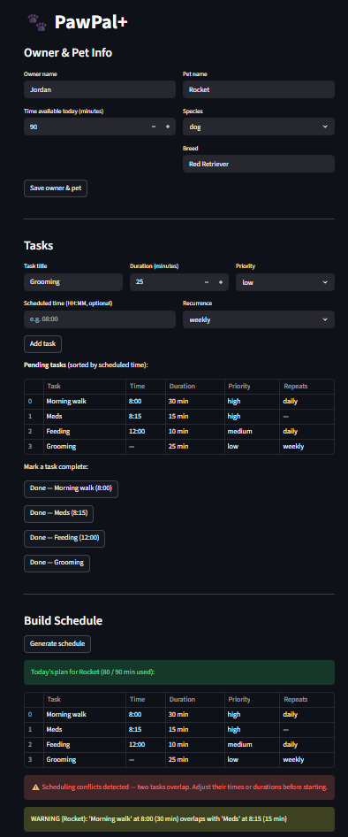

# PawPal+

A Streamlit app that helps pet owners build a smart daily care schedule — automatically sorted, conflict-checked, and recurring.

---

## Features

**Chronological sorting**
Tasks with a scheduled time are automatically sorted earliest-to-latest using `sort_by_time()`. Tasks without a time slot are pushed to the end so they never break the sort order.

**Priority-aware scheduling**
`generate_plan()` sorts pending tasks by time first, then by priority (high → low) as a tiebreaker, and greedily fits as many as possible within the owner's available time budget.

**Daily and weekly recurrence**
Mark a task complete through the app and `mark_task_complete()` automatically queues the next occurrence — one day later for daily tasks, seven days later for weekly — using `timedelta`. No manual re-adding required.

**Conflict detection and warnings**
After generating a schedule, `detect_conflicts()` checks every pair of timed tasks for overlapping time windows. The UI surfaces each conflict as a named warning (e.g. "Walk at 08:00 for 30 min overlaps Meds at 08:15") and tells you exactly how to fix it.

**Cross-pet conflict detection**
`detect_cross_pet_conflicts()` checks tasks across multiple pets' plans so an owner juggling two pets doesn't accidentally double-book themselves.

**Pending / completed filtering**
`get_pending_tasks()` and `get_completed_tasks()` on `Pet` keep the UI clean — only unfinished tasks show in the active list, and completed ones move to a separate table.

**Reset for the next day**
Completed recurring tasks can be reset in one click so they reappear in tomorrow's plan without losing their recurrence settings.

---

## Getting started

### Setup

```bash
python -m venv .venv
source .venv/bin/activate  # Windows: .venv\Scripts\activate
pip install -r requirements.txt
```

### Run the app

```bash
streamlit run app.py
```

---

## Testing PawPal+

```bash
python -m pytest tests/test_pawpal.py -v
```

I wrote 18 tests across four areas:

- **Sorting correctness** - verifies that `sort_by_time()` returns tasks in chronological order, pushes untimed tasks to the end, and handles empty lists without crashing.
- **Recurrence logic** - confirms that marking a daily task complete automatically creates a new task due the next day, weekly tasks land seven days out, and one-off tasks don't spawn duplicates.
- **Conflict detection** - checks that overlapping time windows get flagged, back-to-back tasks (no actual overlap) stay clean, and the warning strings include the pet name.
- **Edge cases** - covers a pet with no tasks, a plan where everything is already completed, and an owner with zero available time.

All 18 tests pass.

**Confidence Level: ★★★★☆**

The core scheduling logic - sorting, recurrence, and conflict detection is all covered. I'd bump it to five stars once the Streamlit UI layer and any user-input validation gets test coverage too.

---

## 📸 Demo




---

## Project structure

```
pawpal_system.py   — core logic: Owner, Pet, Task, Scheduler classes
app.py             — Streamlit UI
tests/
  test_pawpal.py   — 18 pytest tests
reflection.md      — design decisions and trade-offs
```

---

## Smarter Scheduling (Module 2 notes)

Tasks can now have a scheduled time in HH:MM format, and `sort_by_time()` will put them in order for you. It uses a lambda as the sort key so tasks without a time just get pushed to the end instead of breaking anything.

Filtering was also added. You can call `get_pending_tasks()` or `get_completed_tasks()` on any pet to get just what you need, and `filter_by_pet()` on the scheduler if you want to pull tasks for a specific pet out of a bigger list.

Recurring tasks were the big one. Tasks can be set to daily or weekly, and when you mark one complete through `mark_task_complete()` it automatically queues up the next one with the right due date using timedelta. So you don't have to re-add feeding or walks every day yourself.

Conflict detection was also added in. The scheduler checks for overlapping time windows and prints a warning instead of just silently letting two things be scheduled at the same time. It works for a single pet's plan and across multiple pets too.
